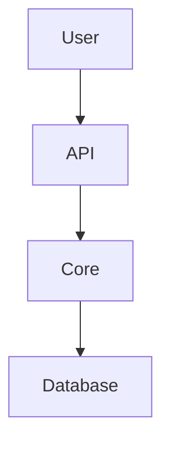

# Design Specification
> **Feature**: [Feature Name]
> **Status**: Draft
> **Requirements Reference**: [Link to requirements.md]

## 1. System Architecture
Describe how this feature fits into the existing FBH architecture.

### Data Flow

## 2. Component Design
- **Component A**: Role and responsibilities.
- **Component B**: Role and responsibilities.

## 3. Technical Decisions
- **Tech Stack**: 
- **Storage**: 
- **Patterns**: 

## 4. Security Considerations
- [ ] Auth required?
- [ ] Data sanitized?
- [ ] Encryption at rest?
